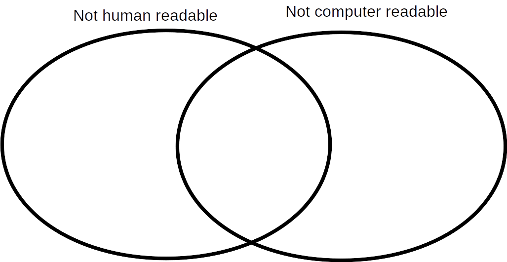
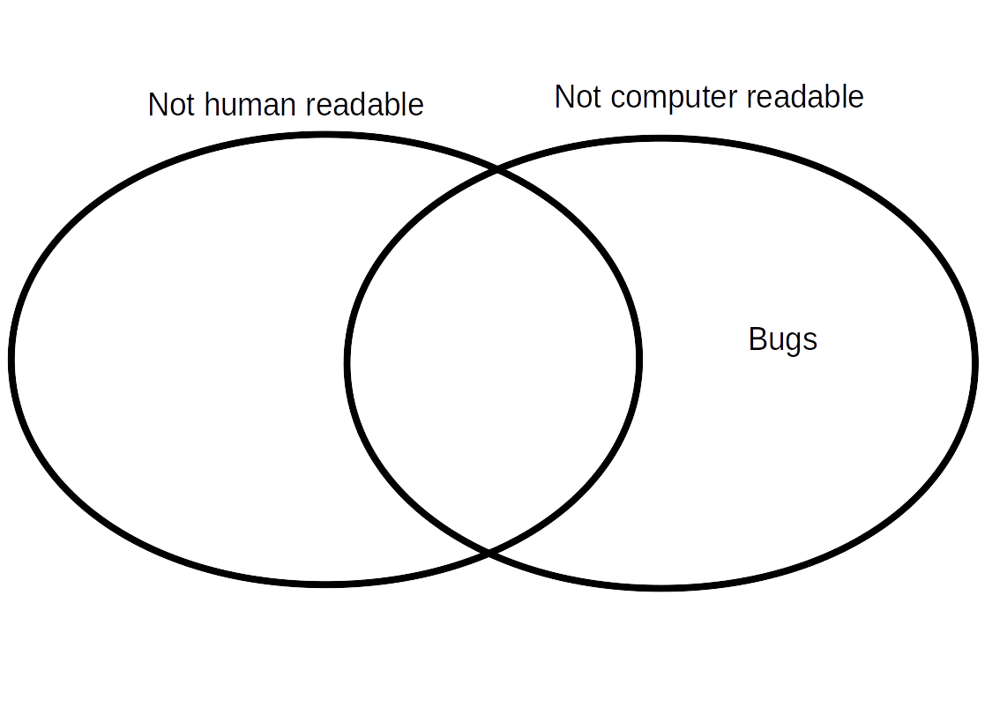
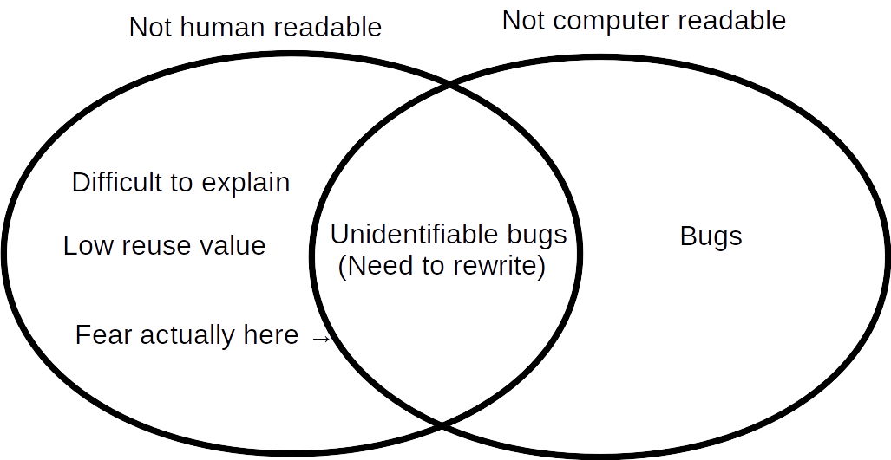

# Why is writing readable code important?

*"If the code runs successfully, who cares how it looks?"* \pause
\vspace{2mm}\hrule

{width=85%}

\vspace{4mm}
\hrule

"I won't edit your code, so I don't care what it looks like." (true)  \pause

"It's frustrating enough just getting the code to work, so I shouldn't feel bad about writing code that doesn't look good." (**[very](https://github.com/StirlingCodingClub/code_readability/blob/main/early_eg.R) [true](https://github.com/bradduthie/PolyInbreed/blob/master/parents.c)**)

# Why is writing readable code important?

*"If the code runs successfully, who cares how it looks?"*
\vspace{2mm}\hrule

{width=85%}

\vspace{4mm}
\hrule

"I won't see your code, so I don't care what it looks like." (true) 

"It's frustrating enough just getting the code to work, so I shouldn't feel bad about writing code that doesn't look good." (**[very](https://github.com/StirlingCodingClub/code_readability/blob/main/early_eg.R) [true](https://github.com/bradduthie/PolyInbreed/blob/master/parents.c)**)

# Why is writing readable code important?

*"If the code runs successfully, who cares how it looks?"*
\vspace{2mm}\hrule

{width=85%}

\vspace{4mm}
\hrule

"I won't see your code, so I don't care what it looks like." (true) 

"It's frustrating enough just getting the code to work, so I shouldn't feel bad about writing code that doesn't look good." (**[very](https://github.com/StirlingCodingClub/code_readability/blob/main/early_eg.R) [true](https://github.com/bradduthie/PolyInbreed/blob/master/parents.c)**)

# Why is writing readable code important?

*"If the code runs successfully, who cares how it looks?"*
\vspace{2mm}\hrule

{width=85%}

\vspace{4mm}
\hrule

"I won't see your code, so I don't care what it looks like." (true) 

"It's frustrating enough just getting the code to work, so I shouldn't feel bad about writing code that doesn't look good." (**[very](https://github.com/StirlingCodingClub/code_readability/blob/main/early_eg.R) [true](https://github.com/bradduthie/PolyInbreed/blob/master/parents.c)**)

# Why is writing readable code important?

*"If the code runs successfully, who cares how it looks?"*
\vspace{2mm}\hrule

{width=85%}

\vspace{4mm}
\hrule

"I won't see your code, so I don't care what it looks like." (true) 

"It's frustrating enough just getting the code to work, so I shouldn't feel bad about writing code that doesn't look good." (**[very](https://github.com/StirlingCodingClub/code_readability/blob/main/early_eg.R) [true](https://github.com/bradduthie/PolyInbreed/blob/master/parents.c)**)

# Sometimes readability is sacrificed for speed

\begin{columns}

\begin{column}{0.5\textwidth} 
\begin{itemize}
\setlength\itemsep{1.0em}
\item Usually better to focus on human readability first
\item Can refactor code later if  \href{https://github.com/bradduthie/PolyInbreed/blob/master/Inbreed.c}{absolutely necessary}
\item Often there are alternative solutions
\begin{itemize}
\item Find a faster computer (short term)
\item Learn a new programming language (long term)
\end{itemize}
\end{itemize}
\end{column}

\begin{column}{0.5\textwidth}

\includegraphics{DuffsDevice.png}
\end{column}
\end{columns}

# What makes code readable?

\begin{itemize}

\item \textbf{Judicious use of comments}
\begin{itemize}
\item Used to clarify where necessary
\item No need to use where redundant \pause
\end{itemize}
\vspace{2mm}
\item \textbf{Clear naming of variables and functions}
\begin{itemize}
\item E.g., 'make\_data\_table' instead of 'mdt'
\item Easier to follow, less need for comments \pause
\end{itemize}
\vspace{2mm}
\item \textbf{Consistent and readable spacing}
\setlength\itemsep{0.0em}
\begin{itemize}
\item Easy to follow indentation style
\item Spaces after commas, semicolons, etc. 
\item Avoid deep nesting where possible
\end{itemize}

\end{itemize}

# Other considerations aiding readability

\begin{itemize}

\item \textbf{What does the code look like on other screens?}
\begin{itemize}
\item Set a limit to characters per line (80 is common)
\item If a lot of code, consider using multiple files \pause
\end{itemize}
\vspace{2mm}
\item \textbf{Break code into manageable chunks}
\begin{itemize}
\item Avoids having to remember a lot all at once
\item Functions that can be viewed without scrolling help
\item Much easier to test (fewer bugs!) \pause
\end{itemize}
\item \textbf{Rstudio tools can be very helpful}
\begin{itemize}
\item Code > Reflow Comment
\item Code > Reindent Lines
\item Code > Reformat Code
\end{itemize}

\end{itemize}

# Find something that works for you

