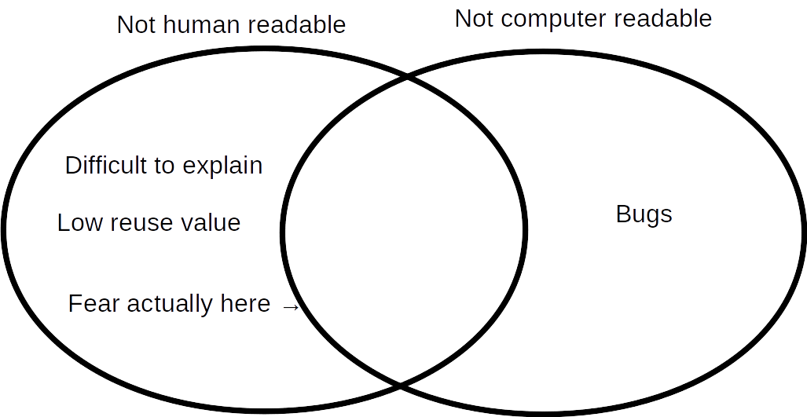

# Why is writing readable code important?

*"If the code runs successfully, who cares how it looks?"* \pause
\vspace{2mm}\hrule

{width=85%}

\vspace{4mm}
\hrule

"I won't edit your code, so I don't care what it looks like." (true)  \pause

"It's frustrating enough just getting the code to work, so I shouldn't feel bad about writing code that doesn't look good." (**very true**)

# Why is writing readable code important?

*"If the code runs successfully, who cares how it looks?"*
\vspace{2mm}\hrule

{width=85%}

\vspace{4mm}
\hrule

"I won't see your code, so I don't care what it looks like." (true) 

"It's frustrating enough just getting the code to work, so I shouldn't feel bad about writing code that doesn't look good." (**very true**)

# Why is writing readable code important?

*"If the code runs successfully, who cares how it looks?"*
\vspace{2mm}\hrule

{width=85%}

\vspace{4mm}
\hrule

"I won't see your code, so I don't care what it looks like." (true) 

"It's frustrating enough just getting the code to work, so I shouldn't feel bad about writing code that doesn't look good." (**very true**)

# Why is writing readable code important?

*"If the code runs successfully, who cares how it looks?"*
\vspace{2mm}\hrule

{width=85%}

\vspace{4mm}
\hrule

"I won't see your code, so I don't care what it looks like." (true) 

"It's frustrating enough just getting the code to work, so I shouldn't feel bad about writing code that doesn't look good." (**very true**)

# Why is writing readable code important?

*"If the code runs successfully, who cares how it looks?"*
\vspace{2mm}\hrule

{width=85%}

\vspace{4mm}
\hrule

"I won't see your code, so I don't care what it looks like." (true) 

"It's frustrating enough just getting the code to work, so I shouldn't feel bad about writing code that doesn't look good." (**very true**)

